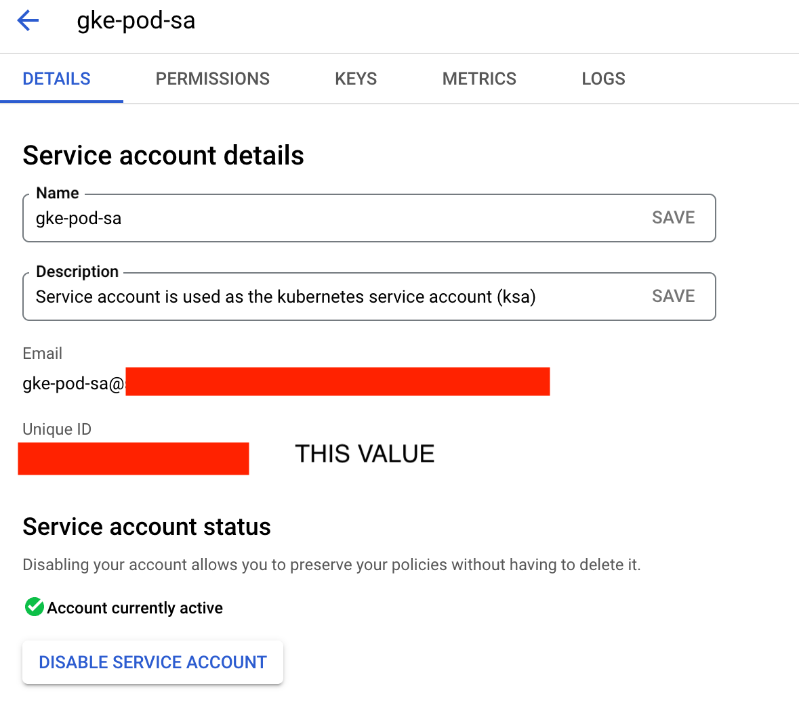
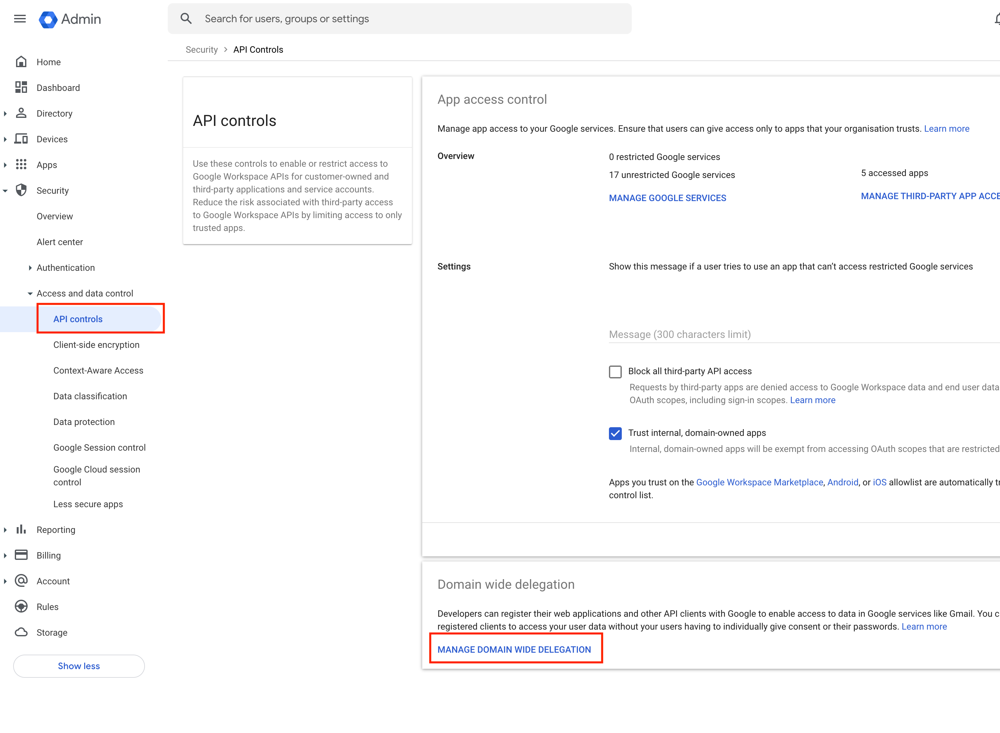
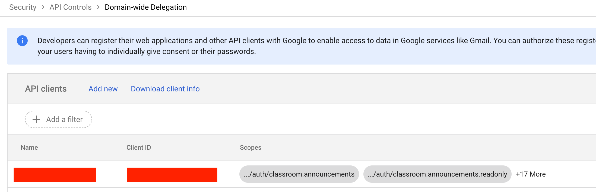

# Installation

## Google Classroom / Workspace Setup

- Google workspace - allow all users to accomodate for other workspaces or Personal (gmail) accounts
  

## Create an Account in Google Admin to be the designated Admin Account for CLP-LMS

- User Account with SuperAdmin Priveleges
- Place this email in the `lms-service-user` secret in Google Secret Manager

## Domain Wide Delegation

Get the unique id (numeric) for the gke-pod-sa Service Account in your project


Go to the Domain Wide Delegation page of Google Admin


Click __Add new__

Add this numeric value, and the following scopes:
https://www.googleapis.com/auth/classroom.announcements,https://www.googleapis.com/auth/classroom.announcements.readonly,https://www.googleapis.com/auth/classroom.courses,https://www.googleapis.com/auth/classroom.courses.readonly,https://www.googleapis.com/auth/classroom.coursework.me,https://www.googleapis.com/auth/classroom.student-submissions.me.readonly,https://www.googleapis.com/auth/classroom.coursework.students,https://www.googleapis.com/auth/classroom.student-submissions.students.readonly,https://www.googleapis.com/auth/classroom.courseworkmaterials,https://www.googleapis.com/auth/classroom.courseworkmaterials.readonly,https://www.googleapis.com/auth/classroom.rosters,https://www.googleapis.com/auth/classroom.rosters.readonly,https://www.googleapis.com/auth/classroom.topics,https://www.googleapis.com/auth/classroom.topics.readonly,https://www.googleapis.com/auth/drive,https://www.googleapis.com/auth/forms.body.readonly,https://www.googleapis.com/auth/classroom.push-notifications,https://www.googleapis.com/auth/pubsub,https://www.googleapis.com/auth/cloud-platform,https://www.googleapis.com/auth/classroom.profile.photos,https://www.googleapis.com/auth/classroom.profile.emails

It should look like this when you're done:




## DNS for Front-End

Add an entry for front-end in addition to backend API

## Scopes needed for Service Account

- https://www.googleapis.com/auth/classroom.announcements
- https://www.googleapis.com/auth/classroom.announcements.readonly
- https://www.googleapis.com/auth/classroom.courses
- https://www.googleapis.com/auth/classroom.courses.readonly
- https://www.googleapis.com/auth/classroom.coursework.me
- https://www.googleapis.com/auth/classroom.student-submissions.me.readonly
- https://www.googleapis.com/auth/classroom.coursework.students
- https://www.googleapis.com/auth/classroom.student-submissions.students.readonly
- https://www.googleapis.com/auth/classroom.courseworkmaterials
- https://www.googleapis.com/auth/classroom.courseworkmaterials.readonly
- https://www.googleapis.com/auth/classroom.rosters
- https://www.googleapis.com/auth/classroom.rosters.readonly
- https://www.googleapis.com/auth/classroom.topics
- https://www.googleapis.com/auth/classroom.topics.readonly
- https://www.googleapis.com/auth/drive
- https://www.googleapis.com/auth/forms.body.readonly
- https://www.googleapis.com/auth/classroom.push-notifications
- https://www.googleapis.com/auth/pubsub
- https://www.googleapis.com/auth/cloud-platform
- https://www.googleapis.com/auth/classroom.profile.emails
- https://www.googleapis.com/auth/classroom.profile.photos


## LTI keys setup

LTI Service requires a pair of rsa private and public keys for signing the jwt token (also referred as lti_message in LTI documentation) and a issuer url.

A pair of RSA private and public keys can be generated using the `generate_rsa_keys.py` script found in the utils folder.

For running the LTI service, a set of RSA public and private keys are picked with the terms `lti-service-public-key` and `lti-service-private-key` from Google secret manager.

## Adding Initial user in the DB

#TODO

## Adding Backend Robot User

A backend robot (service account) user is needed in the database to allow backend services to make authenticated API calls to each other when a User bearer token is not in the API flow. This is particularly neede for cronjobs and LTI callback flows.

1. Hit POST method for users api in user-management microservice with new user's emain id in the api body

API :

``` POST https://<base url>/user-management/api/v1/user ```

Authorization :

``` Bearer Token = <id_token> ```

Body :

```
{
"first_name": "Backend",
"last_name": "Bot",
"email": "bot@core-learning-services-dev.cloudpssolutions.com",
"user_type": "other"
}
```


## Steps to add new user

1. Hit POST method for users api in user-management microservice with new user's emain id in the api body

API :

``` POST https://<base url>/user-management/api/v1/user ```

Authorization :

``` Bearer Token = <id_token> ```

Body :

```
{
"first_name": "",
"last_name": "",
"email": "abc@def.com",  | Required
"user_type": "other",    | Required  // should always be 'other'
"user_type_ref": "",
"user_groups": [],
"status": "active",      | Required  // should always be true
"is_registered": true,   | Required  // should always be true
"failed_login_attempts_count": 0,
"access_api_docs": false, | Required  // should always be false
"gaia_id": ""
}
```

Response samples:

**200**
```
{
"success": true,
"message": "Successfully created the user",
"data": {
"user_id": "124hsgxR77QKS8uS7Zgm",
"first_name": "",
"last_name": "",
"email": "steve.jobs@example.com",
"user_type": "other",
"user_type_ref": "",
"user_groups": [],
"status": "active",
"is_registered": true,
"failed_login_attempts_count": 0,
"access_api_docs": false,
"gaia_id": ""
}
}
```
**401**
```
{
"success": false,
"message": "Unauthorized",
"data": { }
}
```
**422**
```
{
"success": false,
"message": "Validation Failed",
"data": [ ]
}
```

**500**
```
{
"success": false,
"message": "Internal server error",
"data": { }
}
```
