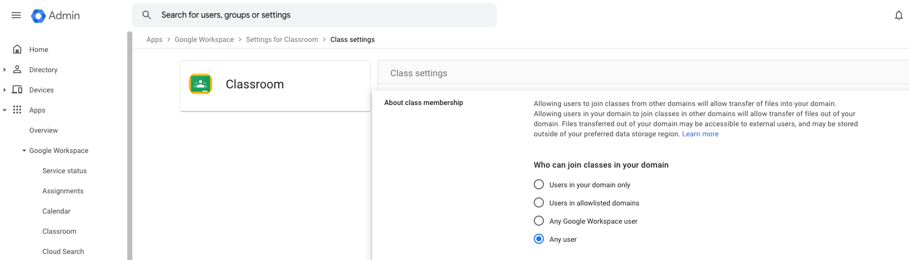

# Installation

- Google workspace - allow all users
  

## Enable Classroom API

The Classroom API Needs to be enabled in the project where the backend Service Account lives

https://console.cloud.google.com/apis/api/classroom.googleapis.com

## DNS for Front-End

Add an entry for front-end in addition to backend API

## Scopes needed for Service Account

- https://www.googleapis.com/auth/classroom.announcements
- https://www.googleapis.com/auth/classroom.announcements.readonly
- https://www.googleapis.com/auth/classroom.courses
- https://www.googleapis.com/auth/classroom.courses.readonly
- https://www.googleapis.com/auth/classroom.coursework.me
- https://www.googleapis.com/auth/classroom.coursework.me.readonly
- https://www.googleapis.com/auth/classroom.coursework.students
- https://www.googleapis.com/auth/classroom.coursework.students.readonly
- https://www.googleapis.com/auth/classroom.courseworkmaterials
- https://www.googleapis.com/auth/classroom.courseworkmaterials.readonly
- https://www.googleapis.com/auth/classroom.rosters
- https://www.googleapis.com/auth/classroom.rosters.readonly
- https://www.googleapis.com/auth/classroom.topics
- https://www.googleapis.com/auth/classroom.topics.readonly
- https://www.googleapis.com/auth/drive
- https://www.googleapis.com/auth/forms.body.readonly

## Steps to add new user

1. Hit POST method for users api in user-management microservice with new user's emain id in the api body

API :

``` POST https://<base url>/user-management/api/v1/user ```

Authorization :

``` Bearer Token = <id_token> ```

Body :

```
{
"first_name": "",
"last_name": "",
"email": "abc@def.com",  | Required
"user_type": "other",    | Required  // should always be 'other'
"user_type_ref": "",
"user_groups": [],
"status": "active",      | Required  // should always be true
"is_registered": true,   | Required  // should always be true
"failed_login_attempts_count": 0,
"access_api_docs": false, | Required  // should always be false
"gaia_id": ""
}
```

Response samples:

**200**
```
{
"success": true,
"message": "Successfully created the user",
"data": {
"user_id": "124hsgxR77QKS8uS7Zgm",
"first_name": "",
"last_name": "",
"email": "steve.jobs@example.com",
"user_type": "other",
"user_type_ref": "",
"user_groups": [],
"status": "active",
"is_registered": true,
"failed_login_attempts_count": 0,
"access_api_docs": false,
"gaia_id": ""
}
}
```
**401**
```
{
"success": false,
"message": "Unauthorized",
"data": { }
}
```
**422**
```
{
"success": false,
"message": "Validation Failed",
"data": [ ]
}
```

**500**
```
{
"success": false,
"message": "Internal server error",
"data": { }
}
```