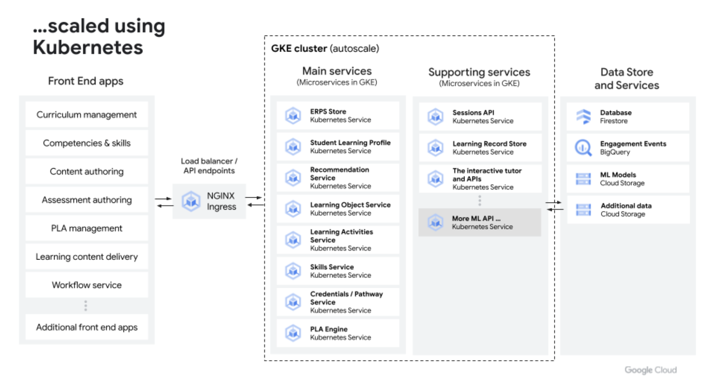

# Cloud Learning Platform

<!-- vscode-markdown-toc -->
* 1. [Overview](#Overview)
	* 1.1. [What is Cloud Learning Platform (“CLP”)](#WhatisCloudLearningPlatformCLP)
	* 1.2. [Why CLP?](#WhyCLP)
	* 1.3. [High-level Architecture Overview](#High-levelArchitectureOverview)
	* 1.4. [Services Highlights](#ServicesHighlights)
	* 1.5. [Vision and Roadmap](#VisionandRoadmap)
* 2. [Getting Started](#GettingStarted)
	* 2.1. [Prerequisites](#Prerequisites)
	* 2.2. [GCP Organizational policies](#GCPOrganizationalpolicies)
	* 2.3. [GCP Foundation Setup - Terraform](#GCPFoundationSetup-Terraform)
	* 2.4. [Deploying Kubernetes Microservices to GKE](#DeployingKubernetesMicroservicestoGKE)
	* 2.5. [Deploying Microservices to CloudRun](#DeployingMicroservicestoCloudRun)
* 3. [Development](#Development)
* 4. [End-to-End API tests](#End-to-EndAPItests)
* 5. [CI/CD and Test Automation](#CICDandTestAutomation)
	* 5.1. [Github Actions](#GithubActions)
	* 5.2. [Test Github Action workflows locally](#TestGithubActionworkflowslocally)
* 6. [CloudBuild](#CloudBuild)

<!-- vscode-markdown-toc-config
	numbering=true
	autoSave=true
	/vscode-markdown-toc-config -->
<!-- /vscode-markdown-toc -->

> This solution skeleton is created from https://github.com/GoogleCloudPlatform/solutions-template

Please contact jonchen@google.com for any questions.

##  1. Overview

###  1.1. What is Cloud Learning Platform (“CLP”)

Cloud Learning Platform is a collection of core services and data models intended to provide the educationally-specific infrastructure for any e-learning ecosystem,  whether K-12, Higher Ed, or Continuing/Professional Education.

These services are turned up in a Kubernetes instance for scalability and management; which also therefore assure the ownership of the data remains fully  in the control of the teaching organization.

CLP has no user surfaces; these are to be integrated (in the case of existing edtech products) or custom built  (a build which is now a very thin UX later, where the CLP services are doing much of the heavy lifting).    The UX, workflow, branding, etc is therefore also fully in control of the teaching organization;   and it  will be possible to make lightweight surfaces for any and all users as desired.

###  1.2. Why CLP?

The most significant challenge currently in e-learning is the siloed nature of the architecture.  Often 5-400 different systems are involved, and very few speak to each other; even fewer speak to each other at the right grain size.  Therefore the goals of CLP are, among others, to:

- Enable all data about the student learning journey to be managed in a central data bus
- Collect + make available data at the right grain size (skills + knowledge) for competency-based learning
- Connect learning all the way through to job skills (and understand the latter)
- Use this data to drive the right AI services to drive AI appropriately for education – not just for personalized student experiences, but also for teachers (knowing the level of the course) and instructional designers (how to create materials for specific skills)

###  1.3. High-level Architecture Overview

###  1.4. Services Highlights

- **Credential Pathway Service** - Offer pathways from existing credentials to higher-level credentials that can be achieved in a given order in a given number of steps
- **Student Mastery Model** service using Deep Knowledge tracing or Item Repsonse Theory  - Offer a variety of methods   of establishing student mastery of specific skills
- **Learning Record Store** - Takes data from any number of sources to track student progress for nudging / research / reporting purposes

###  1.5. Vision and Roadmap

The vision of CLP is to offer a complete services and data layer,  to manage the movement of data to and from all systems in an educational ecosystem, as well as using that data to drive improved outcomes and support,  better reporting, and most importantly better use of AI tools.

In Q3/Q4  2023 our intention is to
- release updates to the knowledge extraction and assessment generation services with improved AI models;   which will include video and image question prompts and responses; as well as “higher order” (vis-a-vis Bloom’s taxonomy) problem solving
- introduce an AI orchestration service to integrate with any and all AI tools that may be relevant to a student or teacher experience
- enable course ingestion of Common Cartridge and HTML documents
- add services for faculty to generate course content, syllabi, and lesson plans
- integrate CLP services into Google Workspace/Classroom

In Q1/Q2 2024, our intention is to
- add services to handle the marketing and enrollment workflow
- add services to enable faculty to create exercises and additional content on the fly, adapted to the skill level of students in their particular section
- add service to grade large numbers of open-ended questions which cannot be fully machine graded, by bucketing similar answers and asking assessors to grade those buckets

##  2. Getting Started

### Prerequisites

Project Requirements

| Tool      | Current Version |
| --------- | --------------- |
| Python    | v3.9            |
| Skaffold  | v1.39.2         |
| GKE       | v1.22           |
| Kustomize | v4.3.1          |

### Installation

Please see [docs/INSTALLATION.md](./docs/INSTALLATION.md) for the full installation steps.

### Development

Please see [docs/DEVELOPMENT.md](./docs/DEVELOPMENT.md) for the development details and process.

