# Firebase Setup

Head to the Firebase Console: https://console.firebase.google.com/

You may need to accept the __Terms & Conditions__ if you haven't already for this account / organization.

You should see you project under `All Firebase projects`. Click it.

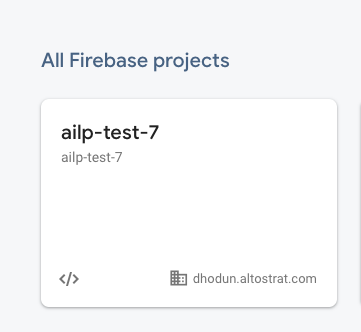

If you click on `Apps` you should see both of your apps, `AI-Tutor`, and `CKT`.

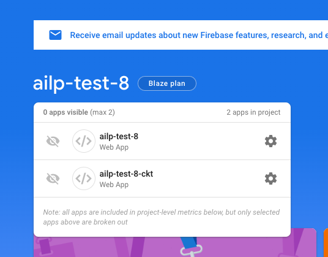

Checkout this repo if you haven't:

```bash
git clone git@github.com:GPS-Solutions/ailearning-frontend.git
```

Run the following:

```bash
git fetch --all --tags
git checkout
```

### Prepare Firebase Apps

Next click on __Build__ and __Hosting__ in the left navigation menu.

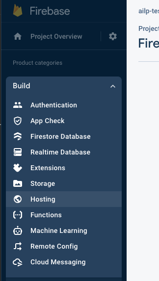

Click __Get Started__

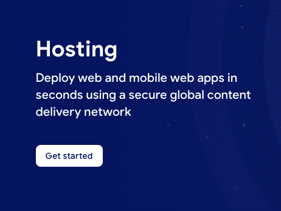

Click __Next__, then __Next__, then __Continue to Console__

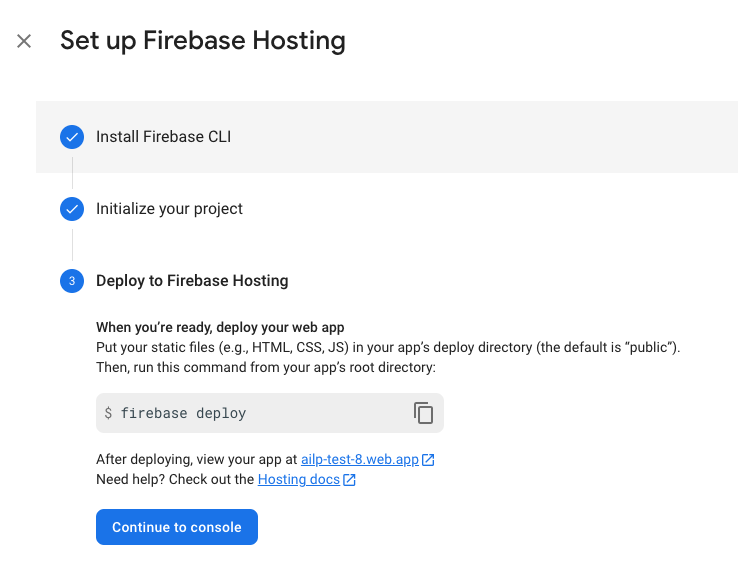

Click __Add custom domain__

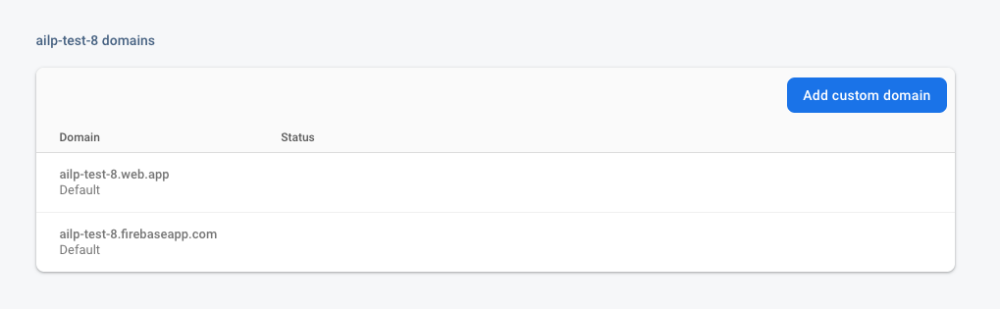

Use the exact output of the `web_app_domain` and enter the following:

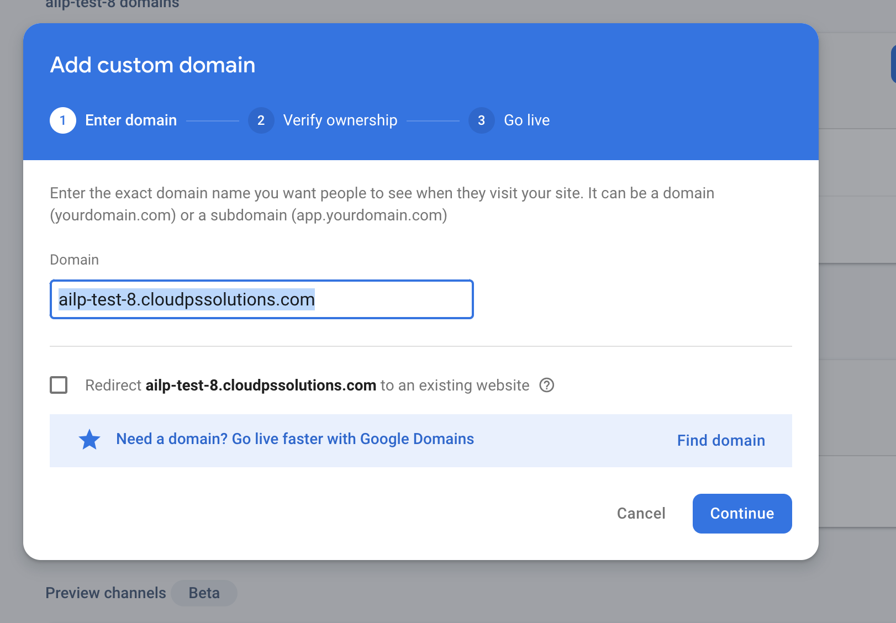

Follow the instructions to verify domain ownership and setup a DNS record.

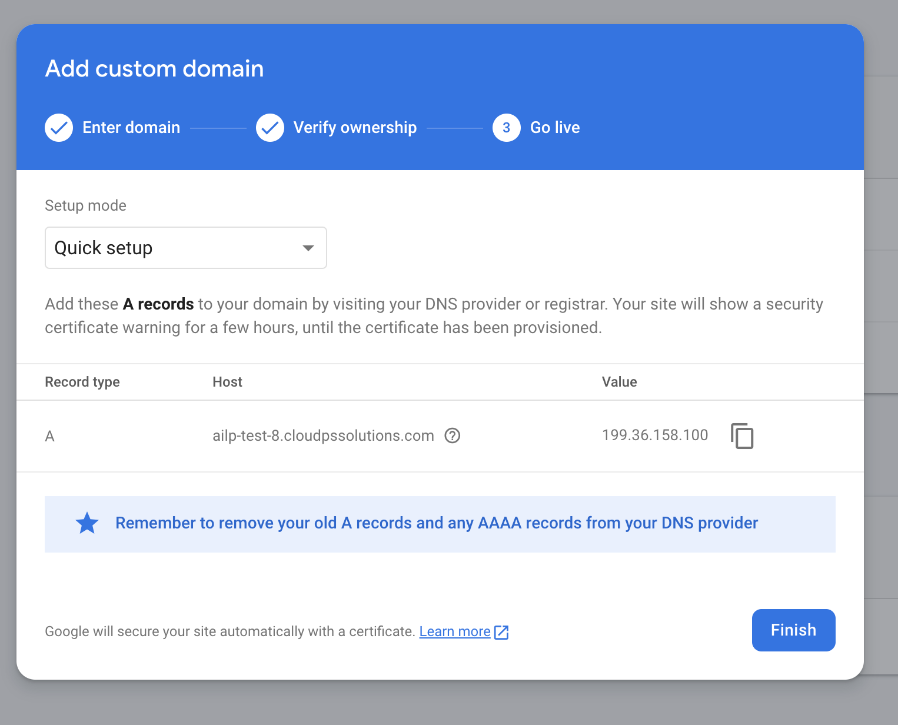

Validate the DNS record is created:

```bash
nslookup YOUR_WEB_APP_DOMAIN
```

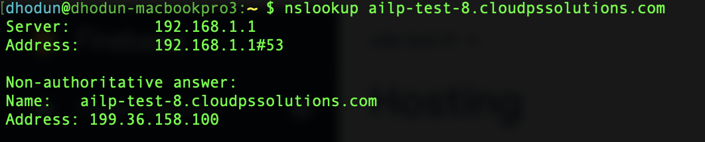

You will see the status of your custom domain change from `needs setup` to `pending`. This can take up to 24 hours for Firebase to provision certificates and start serving on your custom domain name.

Next, you'll need to click **Add another site** to setup the CKT site. This may be at the top or the bottom of the page.

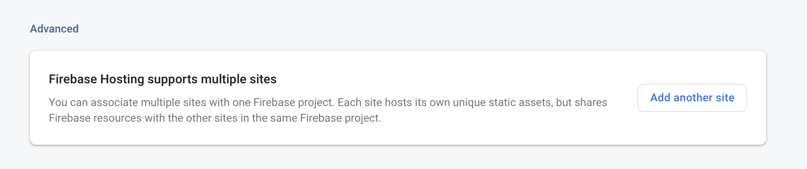

For the site id, use the terraform output `ckt_app_domain` minus the original domain. In our case it will look like this:

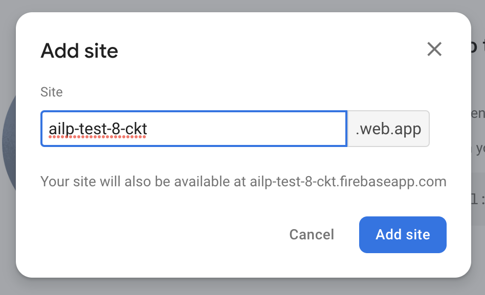

For this site click **View** and **Add custom domain** like the previous example, but in this case use the full name from `ckt_app_domain` and create a DNS record as instructed.

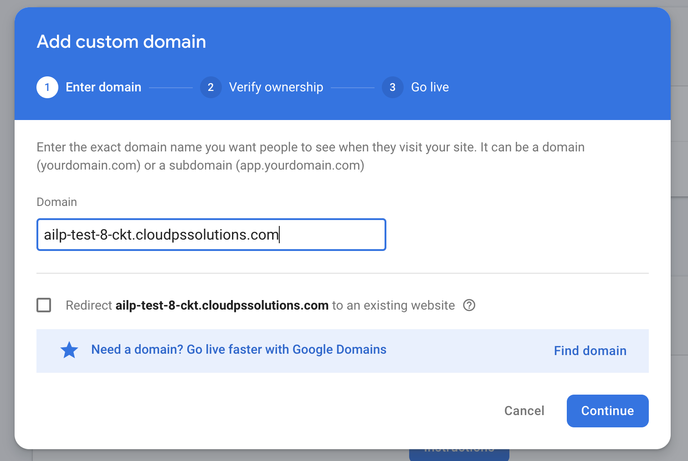

### Backend API DNS Record

In addition to these 2 DNS records for the Firebase apps, you'll also need to create a DNS record for the backend API hosted on GKE. You'll need to create a DNS A record from the following 2 Terraform variables:

* `api_domain`
* `ingress_ip_address`

It will look something like this:

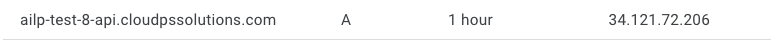

### Firebase Authentication

Click on **Build** then **Authentication** in the Firebase Console

Click **Get Started**. Click **Sign-in method** and select **Google** and click **Enable**. Insert your project ID and your email or an IT admin's email. Click **Save**.

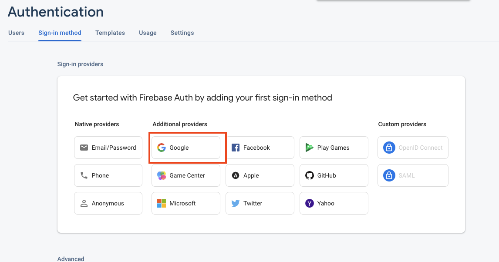

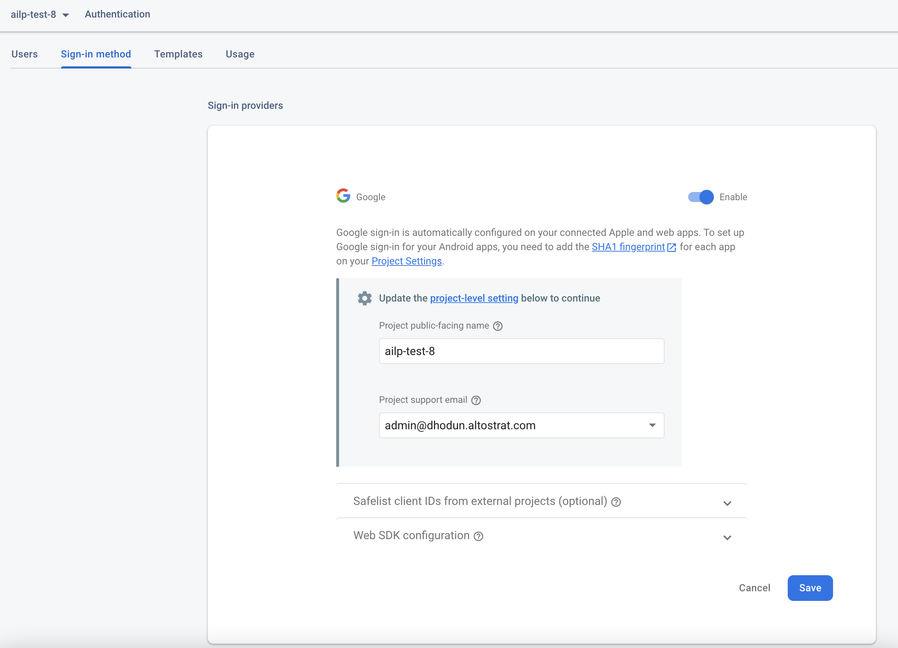

You'll also need to add both your custom domain to **Authorized Domains**. Click on **Settings** then **Authorized Domains**. Use the full terraform output of the `web_app_domain` and `ckt_app_domain` variables.

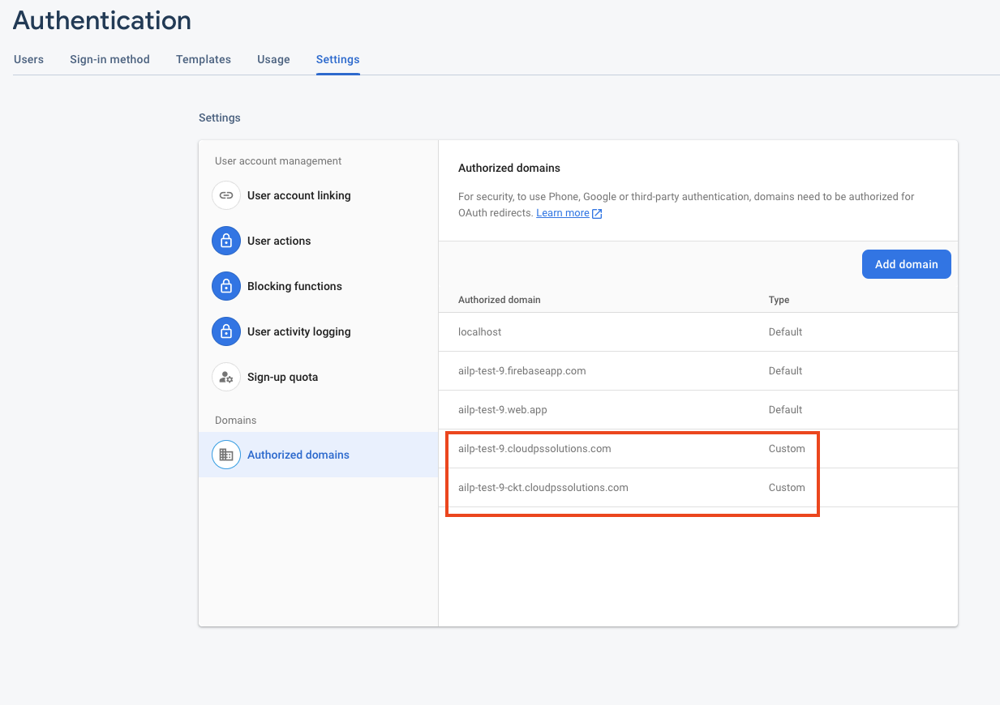

### Summary
In this section you did the following:
- Configured Firebase hosting for custom domains
- Created and configured DNS Records
- Setup Firebase Authentication

## Firebase Deploy

Before we can Deploy the AI-Tutor and the CKT, you need to build a Firebase Cloud Build container to then be used by subsequent deployment jobs. The original instructions are [here](https://cloud.google.com/build/docs/deploying-builds/deploy-firebase#using_the_firebase_community_builder) but copied for your convenience:

```bash
# in a new temporary directory
git clone https://github.com/GoogleCloudPlatform/cloud-builders-community.git
cd cloud-builders-community/firebase

gcloud builds submit .

cd ../..
rm -rf cloud-builders-community/
```

Make sure [the job completes](https://console.cloud.google.com/cloud-build/builds).

Now you're ready to deploy both AI-Tutor and the CKT.

Go to the **Cloud Build Triggers** page of your project. It should look something like this:

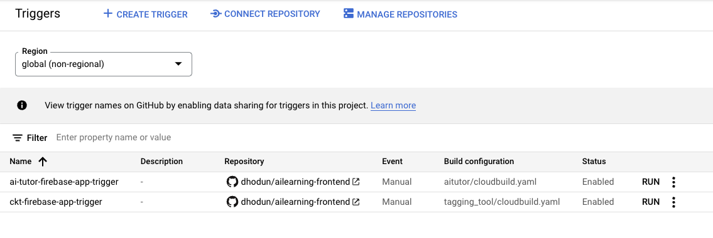

Click **MANAGE REPOSITORIES** to confirm if the WebApp to Github is setup properly. You may need to click **Reconnect**. You may also need to click **CONNECT REPOSITORY** if this is the same time using the Github to Cloud Build WebApp. See [here](https://cloud.google.com/build/docs/automating-builds/github/connect-repo-github) on how to connect the repositories.

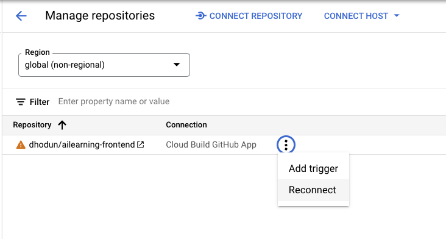


First click **Run** on the **ai-tutor** trigger. Enter the latest version of the app you want to deploy and click **Run**. Then monitor the build job.

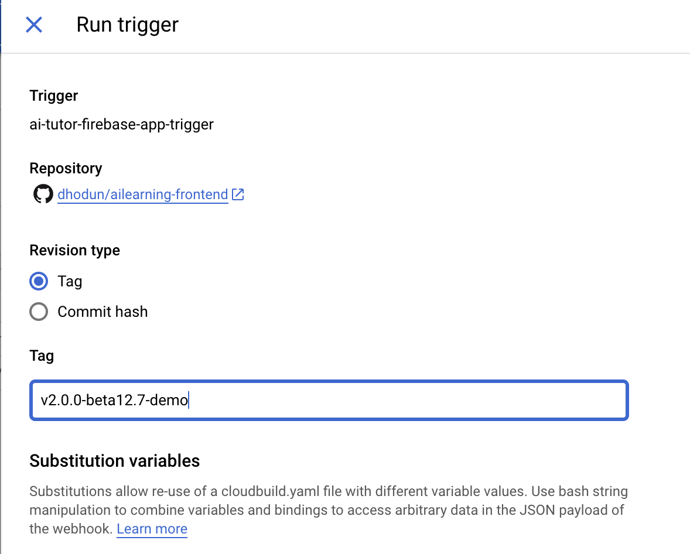

When this job is done, do the same for ckt.

When these are deployed, you should see both sites deployed in the Firebase console in the **Hosting** section:

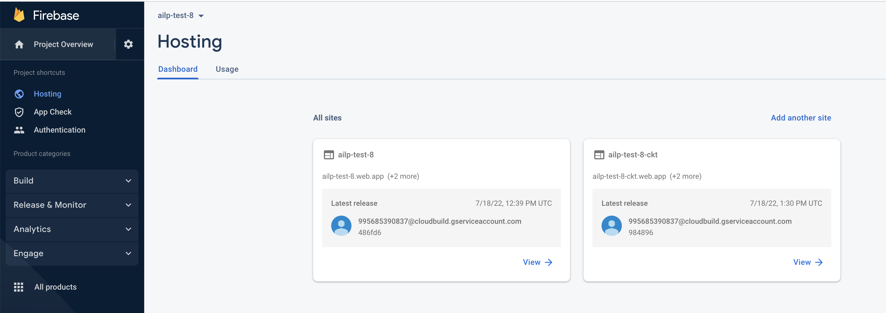

Try both links, including the custom DNS records, to confirm they are both successfully deployed.

Make sure you can login to both tools with a whitelisted email account.
