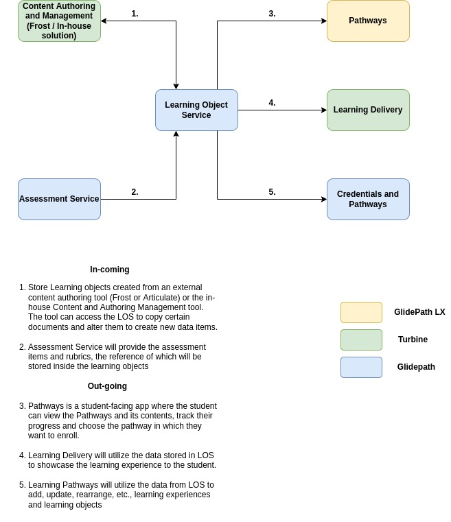

# Learning Object Service

Learning Object Service stores and manages learning objects and their components which can be accessed by learning experience engineers and content designers.

This feature is designed to:

- Create a database to store learning objects and their components which can be accessed by learning experience engineers and content designers

- Ingest learning experiences from 3rd party Content Authoring Tool (Frost) and later, with the in-house solution called Content Authoring and Management

- Send learning experiences to the Content Delivery Platform on demand

- Provide learning experience details to Pathways
- For non-enrolled students, LOS will serve up pathways (including learning experiences) for programs which those learners have indicated interest in
- For enrolled students, LOS will serve up the pathway (including learning experiences) for the program(s) in which they are enrolled

## Features

LOS covers the following features from the high-level perspective. Each feature provides one or multiple API endpoints to provide the functionality.

### General Requirements

- Ability to store learning objects and all of their associated components including
  - Learning Experience
  - Learning Object
  - Learning Resource

- Ability to communicate with content authoring tool to ingest learning experiences authored by LXEs or CDs
  - Note that for Next Step content authoring will take place in a third-party tool and learning object service will ingest those experiences directly from that third party

- Ability to replicate from third party to store those learning experiences when a new experience is created or a current experience is updated

- Ability to push learning experiences to Learning Delivery Platform

- Ability to deliver learning experiences to Pathways
  - For non-enrolled students, LOS will serve up pathways (including learning experiences) for programs which those learners have indicated interest in
  - For enrolled students, LOS will serve up the pathway (including learning experiences) for the program(s) in which they are enrolled

### Engineering-specific requirements

- CRUD operations on the data models that are part of the Learning Object Service, which include:
  - Learning Experience
  - Learning Object
  - Learning Resource
  - Assessment

- Search any data item based on the data model parameters

- Copy any data item and create new data items out of it

- Maintain and access Versions of the four data models that are part of LOS

- Tracking (metadata, unique IDs, etc.) will need to follow through from 3rd party authoring tool

## Architecture

Learning Object Service is a standalone microservice in Kubernetes with auto-scaling pods providing APIs, as one of the key services in Cloud Learning Platform. The APIs will be consumed by the Frontend applications as well as other internal systems.

### Overall data Flow for LOS

Note: 3rd party Content Authoring Tool is MVP for NextStep whereas the in-house solution will be MVP for the overall project.

### ER Diagram

### Learning Object Hierarchy

Learning Paths, Learning Experiences and Learning Objects form the scaffold for educational content in Cloud Learning Platform. The relationship between those objects, as well as Assessment and tagged Skills, is shown in the diagram below.

The data models for Learning Path, Learning Experience and other components

## Components of LOS Ecosystem

### CRUD + Search + Copy APIs

This feature involves create, retrieve, update, delete, search and copy on the following data models:

  - Learning Experience

  - Learning Object

  - Learning Resource
  
This feature will involve the implementation of the following APIs

- CREATE
  - This will involve an API with a POST request which will be able create the above mentioned data models given that the request body contains the required parameters for the creation of the object.
  - Using this API will always result in creation of a new data item.

- RETRIEVE
  - This will involved an API with a GET request which will be able to fetch any of the above mentioned data model objects by the uuid of the data item

- UPDATE
  - This will involve an API with a PUT request which will be able to update the above mentioned data model item given that the request body contains the data in the correct format as required by the data model.
  - When updating the child object with the reference of the parent object, the parent object should automatically get updated with the reference of the child object and vice versa. This allows the relationship to be maintained between parent and child by updating only one of them.

- DELETE
  - This will involve an API with a DELETE request which will allow the user to delete any of the above mentioned data model items.

- SEARCH
  - This will involve an API with a POST request which will allow the user to search any of the data model items based on the parameters that are present in the individual data models.

- COPY
  - This will involve an API with a POST request which will allow the user to create a copy of any of the above data model items given the request body contains the uuid of the data item.
  - It will utilize the RETRIEVE route to fetch the required item and then CREATE route to make a duplicate copy of the item.

### Data Storage and Versioning

Learning Object Service should support versioning of all the data objects that will be implemented in it. These data objects include the following:

  - Learning Resource

  - Learning Object

  - Learning Experience

Versioning allows for creation of multiple variations of the same data object easily. All versions that have been created for a data object can be accessed/updated/deleted.

The details of how the versioning can be implemented is mentioned in the linked document <a href="https://docs.google.com/document/d/1WjhpoH-tZNMLO9r_3Nw_vF2dhAlUMFCpNyQI_LwAOv0/edit?pli=1#heading=h.vz5in2d9nc9p" target="_blank">here</a>.
