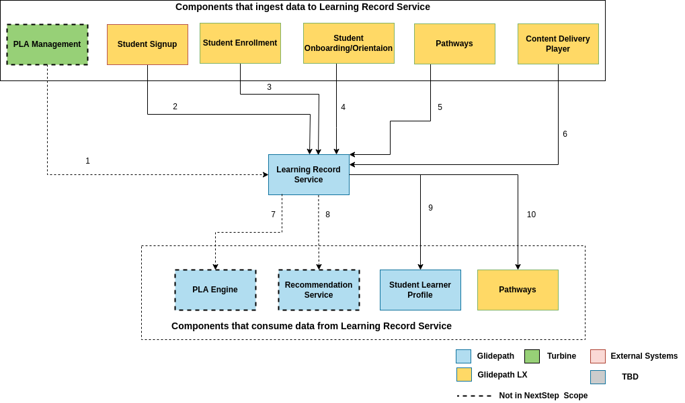

# Learning Record Service

Learning Record Service is one of the components in the Cloud Learning Platform. Its main purpose is to store all the required student activity data via xAPI.

## Scope for Learning Record Service

This service is designed to:

-   Serve a learner record store that stores student activity feed through xAPI integrations. Student activity includes the following
	-   Transactional Data from Content Delivery Player

	-   Behavioral Data from Content Delivery Player

	-   Achievement Data from Content Delivery Player

	-   Progress made in Pathways

-   APIs to retrieve and update learner records

-   Support versioning of learner record documents

## Non-Scope

-   The current scope of LRS does not include the analytics layer on top of LRS which can be used to create dashboards.

## CLP component level flow specific to LRS

<ol>
	<li>PLA Management captures learner records of prior learning assessments which will be used to train PLA Engine</li>
	<li>Student signup/login events get captured to LRS</li>
	<li>Student Enrollment activity gets captured to LRS</li>
	<li>Student activity (both transactional and behavioral) related to documentation uploads, recorded hours etc get captured to LRS</li>
	<li>Student’s progress at pathway level is tracked using LRS</li>
	<li>All events related to student’s performance at an assessment, learning object, learning experience (transactional data) along with the behavioral data gets captured to LRS</li>
	<li>Learner records captured from PLA Management will be used to train PLA Engine</li>
	<li>Recommendation Service leverages the data related to Student's activity at assessment level, learning object, learning experience, learning pathways captured in LRS to train ML model to recommend learning pathways, learning goals, assessment items</li>
	<li>LRS triggers operations to update achievements of Student Learner Profile</li>
	<li>LRS sends realtime pathway level progress.</li>
</ol>

## Experience API Ecosystem Architecture

### Configuring LRS

As part of configuring LRS, we need to design a wrapper microservice around Learner Record Store - hereafter called Learner Record Service where all APIs are defined and which internally routes the data to LRS and other Cloud Learning Platform services using custom triggers

### Defining Triggers

Triggers are the actions configured to be performed based on the statements received

Enterprise LRS like Veracity LRS and Rustici do support built-in triggers along with a provision to customize them further

More Details - TBD

## Capturing Learning Records

### Configuring Learner Record Providers

1.  Scoping out the possible xAPI statements that needs to be captured
	xAPI statements need to be defined for activities that include

	-   Student Login

	-   Completion and scores from an assessment

	-   Hours recorded for a specific experience

	-   Enrolling in a curriculum.

	-   Completion of course/competency/learning experience/learning pathway

	-   Student actions such as password resets/profile updates etc.

Identify the right applications along with the user journeys that incorporate individual statements

2.  Capturing configured xAPI statements

	 Learner applications capture learner actions as per the configured xAPI statements, mainly considering the following fields

	- Learner ID

	- Activity ID - Can be one of the following

		-  Assessment Item along with score

		-  Learning Object

		-  Learning Experience

		-  Learning Pathway

		-  Profile specific fields

	-  Action (Verb)

	All the IDs for the above fields represent their respective UUIDs as stored in firestore

### Sending xAPI statements to Learner Record Service

All the captured xAPI statements will be sent to the learner record service, a wrapper around the learner record store

### Validating and storing xAPI statements in Learner Record Store

On receiving the xAPI statement requests, the Learner record service forwards the same to the learner record store which gets validated and stored in LRS

### Checking for event-based triggers

Also, the Learner record service checks whether it needs to start any trigger based on the incoming xAPI statement

This check can happen within the learner record store itself if we go for any pre-built LRS that supports Plugins/ Triggers

Otherwise, similar functionality needs to be implemented in the learner record service wrapper

- Sample Trigger

	xAPI statement - User 1 has completed Learning experience 1

- Action to be performed

	An API call to SLP, updating Learning Experience 1 in user 1’s achievements

## Features

### NextStep Features:

1.  Ability to collect and store transactional data relating to learning experiences including:

	-  Scores from an assessment

	-  Assignment Grades

	-  Hours recorded for a specific experience

	-  Timestamps for assignments

	This data will be collected via xAPI from the content delivery player

2.  Ability to collect and store behavioral data related to the learner’s activity including:

	-   Learning resources utilized

	-   Engagement with those resources (complete/incomplete, progress made, etc.)

	-   Time to completion

	-   Attendance in class

	This data will be collected via xAPI from the content delivery player

3.  Ability to deliver pathway progress to Pathways

4.  Ability to deliver learning experience preference data to student learner profile

5.  LRS needs to be able to identify that an ingested record belongs to an established user

### Overall Epic Features:

#### General requirements

-   Service stores records of learner progress through the curriculum

	-   This includes progress through offered content from CLP apps and any previously-done work that is recognized by our “PLA” system

	-   Record stores biographical information

	-   Credential objects will not be stored in Learning Record, but the actions in earning them will be captured here

-   Service can automatically ingest learner records provided by identified xAPI sources

	-   Service can verify an ingested record belongs to an established user

	-   Service can ingest real-time record updates

-   Service edits stored learner records with ingested records

	-   Stores changelog of record and can restore the previous version if needed

#### User type / area-specific requirements

-   Learner records can be manually edited by admins

	-   Useful for correcting mistakes or keeping things running if automated updates are broken

	-   System stores changelog to track edits and restore backups

#### Engineering-specific requirements

-   Automated ingestions have CRUD operation capabilities with existing learner records

-   Records can be accessed by Recommendation Service and Learner Profile

-   Service can communicate with systems that store credential information (Badgr, Kuali, SIS, etc.)

	-   Credentials coming from outside are expected to be processed by other services before reaching Learning Record Service

	-   It will mostly be done via xAPI