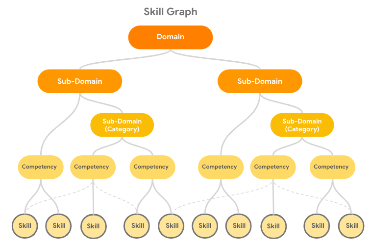
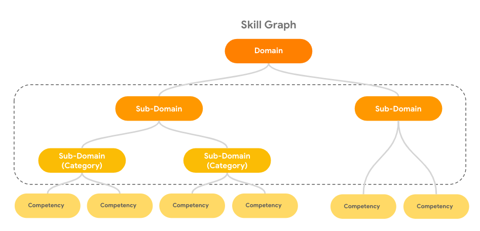
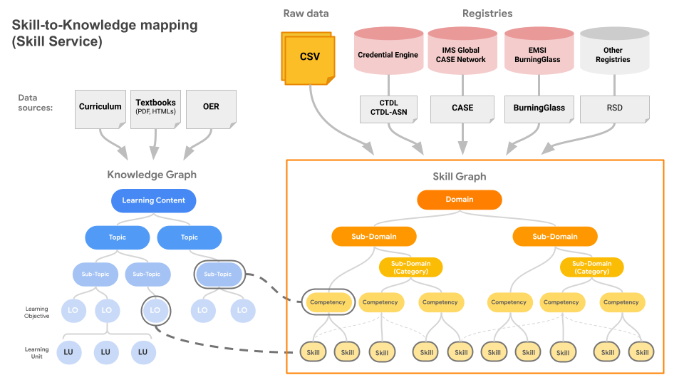

# Skill Service

Skill service maintains all Skills and their hierarchy/relationship trees. It provides APIs to ingest existing skill graphs in various supported schemas, including CDTL, OSN and EMSI BurningGlass.

Additionally, Skill Service:
- Automatically maps Skills to Knowledge
- Evaluates Skill alignment: given two Skills, score their similarity and enumerate differences in Role profile (which Roles from ERPS are associated with the Skill) and knowledge coverage.
- Provides API to retrieve, search and update Skills.

## Features

Skill Service covers the following features from the high-level perspective. Each feature provides one or multiple API endpoints to provide the functionality.

- Skill tree/graph management
  - Maintains all Skills and their hierarchy/relationship trees
- Skill graphs ingestion
  - Ingests existing skill graphs in various supported schemas, including:
    - CDTL (Credentials Engine)
    - RSD (Rich Skill Description)
    - CASE (IMS)
    - BurningGlass (EMSI)
- Skill-to-knowledge mapping
  - Map Skills Graph to Competency Knowledge Graph (CKG) generated from course content.
- Skill alignment
  - Align two or more skills that are identical or similar to one another. E.g. a Skill ingested from IMS Global CASE is quite identical to a Skill ingested from EMSI Burning Glass, even these two Skills have different names.

## Skill Graph

A Skill graph is a tree-like structure composed of hierarchical nodes in the corresponding levels below:

### Domain

This is the top level node of a Skill graph. All skill leaf nodes can always trace back to one Domain node.
Overarching profession, discipline, or industry.(EX: IT)

### Sub-domain

Subdomains are the second tier of a Skill Graph, which will always point to one Domain or another Subdomain as its parent node, for the flexibility of constructing multi-layer Subdomain structure.

- A Subdomain links to a Domain node as its parent
- A Subdomain links to another Subdomain node as its parent, this creates an additional layer of subdomains. See the diagram below for examples:

Large functional areas within the domain (EX: Process and Methodology)

- Sub-domains may cross domains
  - A sub-domain can be a **Category (Optional)**:  applications of a sub-domain in a particular industry or field of study.
  - In order to keep the flexibility of the tree structure, we will treat **Category** as a type of Sub-domain.
  - Align with Emsi skill categories (EX: Project Management)
  - Categories may cross sub-domains in other domains

### Competency

The Competency schema extends based on the [Rich Skill Descriptor](https://rsd.openskillsnetwork.org/#align-a-credential-to-rsds) (RSD) with CTDL-ASN/CTDL recipe schema.

Additional notes about Competency:

- A Competency node can point to one or multiple parents which is:
  - A Category node (Optional)
  - A Subdomain node (default relationship)
- Both Skill and Competency are called Competency in CTDL, but we will use separate schemas here.

- Competency in Skill Graph vs. Competency in Competency-Knowledge Graph

  Please note that the Competency in Skill Graph is different from the Competency in CKG from CLP V2. The diagram below explains the difference and relationship between Skill Graph and CKG graph. (In later stage, we will change the Competency in CKG to something else)

- Competency in Skill Graph: competencies are comprised of knowledge, skills, capabilities, and dispositions
- Competency in CKG: a knowledge topic or subtopic that is composed of Sub-competencies and Learning Units from a course content (e.g. a textbook), and eventually is aggregated to a Learning Content.

The 1-credit competencies that make up the category (EX: Plan work)

- Competencies may appear in other categories across other sub-domains and domains
- Skill:  the knowledge, capabilities, and dispositions essential to demonstrate the competency (EX: Develop realistic timelines)
  - Skills may appear in other competencies across other sub-domains and domains

## Skill Ingestions

### Ingestion from External Registries

One of the primary jobs for Skill Service is to ingest data from various registries. The primary top three in the market includes:

- EMSI Burning Glass
- Credential Engine (with CTDL-ASN and CTDL schema)
- IMS Global (with CASE schema)

