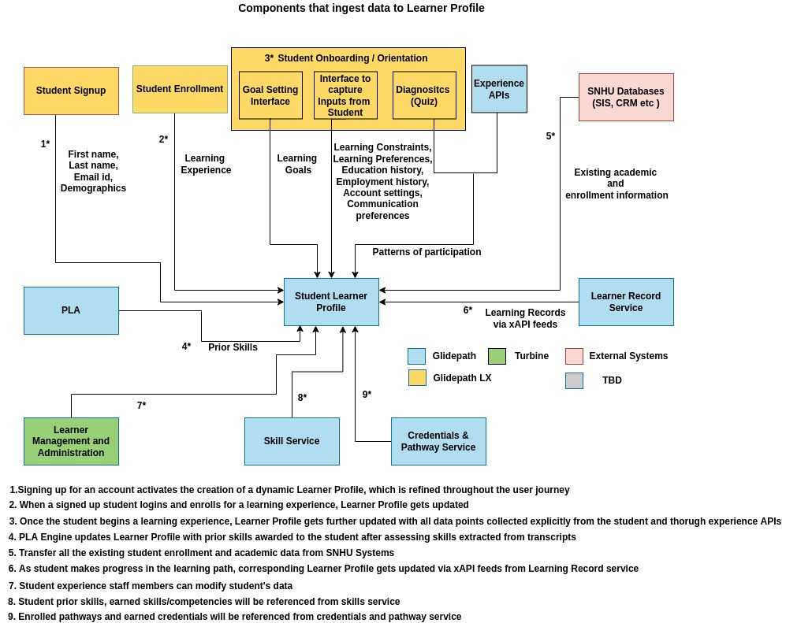

# Student Learner Profile

Student Learner Profile Service maintains Learning Profile and provides APIs to do CRUD on student profile and associated data models like learner progress.

This feature is designed to

- Create, maintain and access Student Learner Profile (SLP). The SLP will include information about student’s learning goals, learning constraints (such as number of hours a week available for learning), learning styles, preferences and patterns of participation and engagement for that student across learning tools.

- Ingest data from existing Caliper/xAPI data feeds into the Student Profile

- Ingests Learning Records via xAPI data feeds from Learning Record Store

- Integrate SIS and LMS data streams to feed engagement and achievement data into SLP.

- Support CRUD operations and search on each Student Learner Profile.

- Enhance the existing Student Mastery Model to incorporate evidence from the student mastery model for summative assessments and the data layer.

## Features

SLP covers the following features from the high-level perspective. Each feature provides one or multiple API endpoints to provide the functionality.

- Data Ingestion:

	- Ingest information explicitly requested from the student through CLP apps

	- Ingest data from xAPI feeds from Learner Record Service

	- Ingest academic and enrollment information from databases such as

		- SIS

		- CRM

		- Others (TBD)

- Student Learner Profile Creation

	- Create a student learner profile based on student background, learning goals, learning constraints, learner preferences, learning behaviors and interactions, and account preferences.

- Student Learner Profile Management:

	- Update the learner profile as the student makes progress in the learning journey.

- Student Mastery:

	- Predicts the level of mastery for a student across the entire Skill graph that they are engaged in, based on engagement and learning events

	- Predicts the successful completion for a given student for any Learning Object, based on modality and content and other metadata for that Learning Object

## Architecture

### Overall SLP Architecture

This diagram includes two flows

1. **Components that ingest data to Student Learner Profile (SLP as a sink)**

    

    **In Baymax’s scope**

    - Student Signup

      - First Name

      - Last Name

      - Email Id

      - Demographics (geo location of the student)

    - Student Enrolment

      - There will be a fixed learning experience (CNA program)

      Attestation Object (Attestation checklist object is enrolment specific and collected prior Learning Pathway)

      - Location

      - Potentially docusign

      - Additional fields TBD

    - Student Onboarding / Orientation

      - Learning Goal Interface

        - There will be only one fixed learning goal. The interface to set learning goal is out of Baymax’s scope

      - Information collected from student explicitly

        - Education history

          - Only high school certificate is considered for attestation

          - Vaccination certificate

        - Employment History

          - Current Employer information

        - Learning Constraints - Out of Scope

        - Learning Preferences - Out of Scope

        - Account Settings - Out of Scope

        - Communication Preferences - Out of Scope

    - Patterns of participation

      - Data collected via Experience APIs - TBD

      - Diagnostics (Quiz) - Out of scope

    - Data from Database - Out of Scope

    - Data from PLA Engine - Out of Scope

    - Data from Learner Record service - TBD

2. Components that consume learner profiles from Student Learner Profile (SLP as a source)

    

### Data Ingestion

#### Student Information from CLP Apps:

This includes:

- Information explicitly requested from the student on their learning goals and learning constraints. This includes:

	- number of hours a week available for learning

	- Access to reliable wifi or a device.

	- Other constraints (TBD)

- Patterns of participation and engagement for that student across the ClP system.

- Information explicitly requested from the user regarding demographics, education history, and employment history.

- Information explicitly requested from the user regarding account settings and communication preferences.

- Student enrollment information

#### xAPIs feed from Learner Record Store:

Ingests Learning Records via xAPI data feeds from Learning Record Store

#### Existing information from Databases:

Transfer data with and display data from databases (SIS, CRM, etc.) to track and display academic and enrollment information (e.g.: assigned/ registered credits/ competencies, academic history, financial aid awards, enrollment status, etc.) and marketing information (Marketo).

### ER Diagram

Link Descriptions:

## Student Mastery

This section explains the student mastery machine learning models that exist in the Cloud Learning Platform

### Item Response Theory(IRT)

IRT is a statistical theory comprised of a variety of mathematical models that can be used to develop, evaluate, and score psychological tests. It is possible to compare the ability/trait of the individual with the properties of the item and to estimate the probability that the individual’s response to it with Item Response Theory (IRT).

[IRT Model Types:](https://www.publichealth.columbia.edu/research/population-health-methods/item-response-theory#:~:text=1%20Monotonicity%20%E2%80%93%20The%20assumption%20indicates,for%20each%20item%20in%20the)

1. **The 1- Parameter logistic model**

The model is the simplest form of IRT models. It is comprised of one parameter that describes the latent trait (ability – θ) of the person responding to the items as well as another parameter for the item (difficulty).

2. **The 2- Parameter Logistic Model**

The two parameter logistic model predicts the probability of a successful answer using two parameters (difficulty bi & discrimination ai). The discrimination parameter is allowed to vary between items.

3. The 3 – Parameter logistic model

The Model predicts the probability of a correct response, in the same manner as the 1 – PL Model and the 2 PL – Model but it is constrained by a third parameter called the guessing parameter

For training:

The model is trained for each learning unit to find the difficulty levels of assessments in it. Following data is used for training:

- Student Id

- Item_id

- Student Response

Output:

For a 2-Parameter Model the training updates the difficulty and discrimination of the items used in training. The parameters along with the calculated student ability can be used to find the probability of answer the questions in a learning unit. This can we used to give student either a difficult item or an easy item based on his past responses.

### Student Mastery using Deep Knowledge Tracing

This model is trained to predict the mastery score of a student for a learning unit

- Inputs

	- Student id

	- Sequence of assessments attempted by the student, where the sequence the number is fixed and the assessment items can be from different learning units

- Output

	- Likelihood of correct response of assessments related to current learning Unit

	- In other words, student mastery score for the current learning unit

- Time series representation of student activities, assessment items, in current and other learning units - basic RNN used in [Deep Knowledge Tracing](http://stanford.edu/~cpiech/bio/papers/deepKnowledgeTracing.pdf)

- Assumptions

	- We know result of assessment (i.e. right/wrong)

	- We know which LU assessment item belongs to

#### About Deep Knowledge Tracing

**Knowledge Tracing**

Knowledge tracing is the task of modelling student knowledge over time to accurately predict how students will perform in future interactions.

**[Deep Knowledge Tracing](http://stanford.edu/~cpiech/bio/papers/deepKnowledgeTracing.pdf) (DKT)**

- An approach to solve the Knowledge Tracing problem using Recurrent neural networks (hereafter referred as RNNs) are a family of flexible dynamic models which connect artificial neurons over time.

- Here two different types of RNNs – a vanilla RNN model with sigmoid units and a Long Short Term Memory (LSTM) model – have been applied to the problem of predicting student responses to exercises based upon their past activity

- **Model**
	Traditional Recurrent Neural Networks (RNNs) or LSTMs map an input sequence of vectors x1, . . . , xT , to an output sequence of vectors y1, . . . , yT . This is achieved by computing a sequence of ‘hidden’ states h1, . . . , hT which can be viewed as successive encodings of relevant information from past observations that will be useful for future predictions. See Figure 2 for a cartoon illustration. The variables are related using a simple network defined by the equations:
	*h*~t~=tanh(*W*~hx~*X*~t~ + *W*~hh~*h*~t-1~ + *b*~h~)  
	*y*~t~ = σ (*W*~yh~*h*~t~ + *b*~h~)

- **Inputs**

	- The inputs (xt) to the dynamic network are either one-hot encodings or compressed representations of a student action.

	- For datasets with a small number M of unique exercises, set xt to be a one-hot encoding of the student interaction tuple ht = {qt, at} that represents the combination of which exercise was answered and if the exercise was answered correctly, so xt ∈ {0, 1}^(2M).

	- If M is very large, the one hot encoded vectors are reduced to smaller dimension N (N << M) using a technique called Compressed Sensing (not implemented in the paper)

- **Outputs**  
    The output *y*~t~ is a vector of length equal to the number of problems, where each entry represents the predicted probability that the student would answer that particular problem correctly. Thus the prediction of *a*~t+1~ can then be read from the entry in *y*~t~ corresponding to *q*~t+1~
