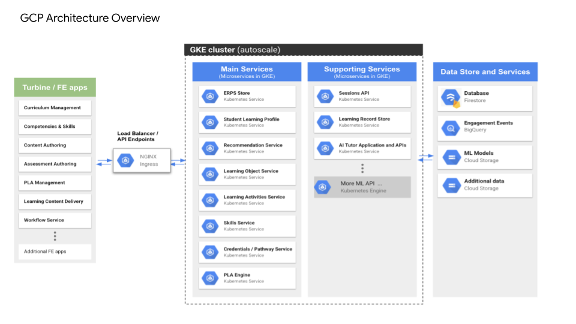

# Cloud Learning Platform Architecture

The Cloud Learning Platform REST APIs are deployed as microservices in Google Kubernetes engine and uses firestore as primary datastore and bigquery as analytics and learning analytics store. These APIs are consumed by Faculty facing applications as well as Learner-facing applications. These APIs and services ingest data from external applications and provide interoperability with other learning tools through LTI.

