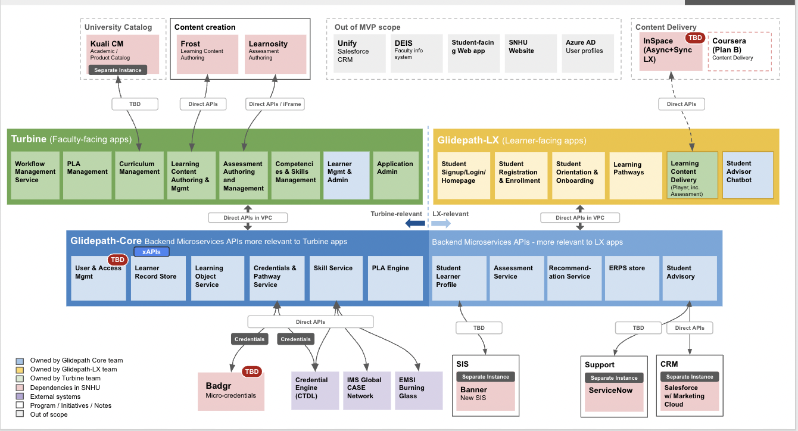

# Overall Architecture

The architecture diagram above shows how Cloud Learning Platform is connected to other systems, and external data sources. It shows an example of a  complete set of user-facing apps, also discussed below, along with supporting services.