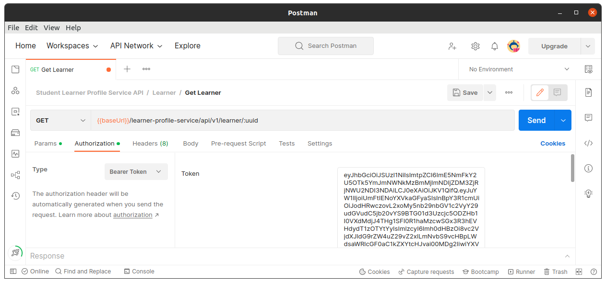

# Token generation to access APIs

The following steps are to generate the token required to access APIs


### Sign up of a user

Before user signs up to the platform, user needs to have their email id added to the database.  This can be done manually using the Firebase console.

Once the user email id is added to the database then the user can use the **POST** request to the API endpoint - **`<APP_URL>/authentication/api/v1/sign-up/credentials`**

The request body for the API is as follows:

```json
{
  "email": "jon.doe@gmail.com",
  "password": "Test@1234"
}
```

Once the user is signed up successfully then the response message would be as follows:

```json
{
  "success": true,
  "message": "Successfully signed up",
  "data": {
    "kind": "identitytoolkit#SignupNewUserResponse",
    "idToken": "eyJhbGciOiJSUzI1NiIJ...X2ybGwFvMhw",
    "email": "jon.doe@gmail.com",
    "refreshToken": "AOEOulblOMdQ4OU...lbRSuDcUAZPUbYL1_u",
    "expiresIn": "3600",
    "localId": "bIj8K69RzActKzcCN6yE1V13Pqr1",
    "session_id": "asd98798as7dhjgkjsdfh"
  }
}
```

And incase if there is any error during the sign up then the error message would be as follows with the appropriate message:

```json
{
  "success": false,
  "message": "Email already exists",
  "data": []
}
```

The **`idToken`** generated in the above response can be used to access the other API endpoints.

### Sign in of a user

If the user has already completed the sign up process then the user should make a **POST** request to the sign in API endpoint - **`<APP_URL>/authentication/api/v1/sign-in/credentials`** for token generation.

The request body for the API is as follows:

```json
{
  "email": "jon.doe@gmail.com",
  "password": "Test@1234"
}
```

Once the user is signed in successfully then the response message would be as follows:

```json
{
  "success": true,
  "message": "Successfully signed in",
  "data": {
    "kind": "identitytoolkit#VerifyPasswordResponse",
    "localId": "XmtYBlBM9dZKDIQ1cP0lh2kBY163",
    "email": "jon.doe@gmail.com",
    "displayName": "",
    "idToken": "eyJhbGciOiJSUzI1NiIJ...X2ybGwFvMhw",
    "registered": true,
    "refreshToken": "AOEOulblOMdQ4OU...lbRSuDcUAZPUbYL1_u",
    "expiresIn": "3600",
    "session_id": "asd98798as7dhjgkjsdfh"
  }
}
```

And incase if there is any error during the sign in then the error message would be as follows with the appropriate message:

```json
{
  "success": false,
  "message": "Invalid password provided",
  "data": []
}
```

The **`idToken`** generated in the above response can be used to access the other API endpoints.

### Using token to access APIs

When making a request to an endpoint then the generated **`idToken`** needs to be passed in the Authorization headers as a Bearer token.

If we need to fetch the details of a learner then we would get those details by making a GET request to the API endpoint - **`<APP_URL>/learner-profile-service/api/v1/learner/{uuid}`** where uuid is the unique ID of the learner.



If the token is a valid one then the successful response from the API request would be provided. Incase if the token is not valid or expired then the appropriate error message would be provided.
