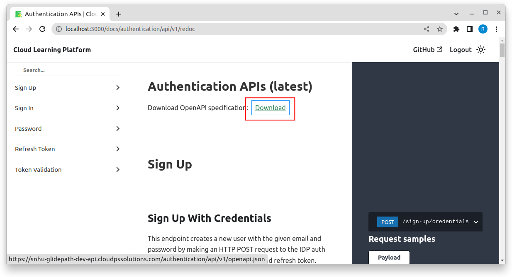

# Importing the apis as a postman collection

Use the below steps to import all apis in a postman collection and use it for testing.

## 1. Download the openapi-specs.json file

You should be able to download the openapi spec json in any of the redoc-api ui present in this documentation.

## 2. Upload the json to postman collection import section

- Click on import in collections tab

- Click on OpenAPI in file tab

- Select the downloaded json and in `Show advanced settings` section, change `Folder organization` to `Tags`

- Click import

You should be able to see all apis of the service imported in your postman

:::note
To use authenticated apis in any services available in CLP, you are required to have a bearer token. You can get it by using <a href="/authentication/api/v1/redoc#tag/Sign-In/operation/sign_in_with_credentials_sign_in_credentials_post" target="_blank">/sign-in/credentials api</a> or if you dont have a password, you can use the token stored in localstorage with the key `idToken`.
:::