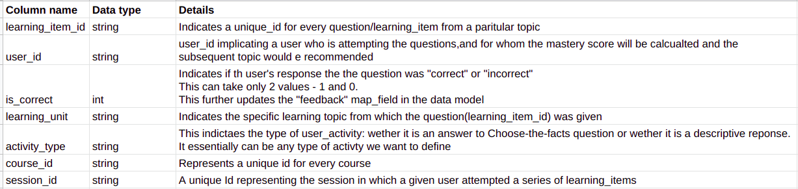

# Creation of user events using the bulk upload endpoint

The following steps are required to upload a bulk of user events from a csv file

### Step 1:

(Currently this supports creation of user events only using csv file(s))

The first step is to create a csv file containg all the user events. The csv file needs to designed in alignemnt to the sample user event schema as indicated in the csv.
Please find the <a href="https://docs.google.com/spreadsheets/d/1HxzMXDXSPgIsf0-rfXu3n1Yp6_z3JdvYG4I6eG4tYPM/edit?pli=1#gid=0">link</a> to the sample google sheet with the schema and a sample csv for testing. The README.md in the sheet serves as a data dictionary to understand the implicationsof the various fields in the csv.
The sample sheet can be download as a csv file or a new google sheet adhering to the file schema can be created and downloaded as a csv.



The snapshot above illustrates the data dictionary of the csv. The column names represent the required(compulsory) fields in the csv file, along with the required data type of the columns/fields.

Please refer to the next section for getting a sample CSV with synthetic data that follows the requested schema.
### Step 2:

To create user events in a bulk, the API url is **`<APP_URL>/deep-knowledge-tracing/api/v1/bulk-upload`**
The user simply needs to upload the csv file(s) from local.

This would trigger an upload job to create and update the user event collection.

### Step 3:

Once the job is completed succesfully, it will show the following success repsonse:

```json
{
  "success": true,
  "message": "Successfully created the user events",
  "num_user_events": 1000,
  "course_ids": [
    "course3",
    "course1",
    "course2"
  ]
}
```

Here, "num_user_events" indicates the number of user events that have been created in the collection.

For any discrepancies with regards to the schema of the file uploaded approprite error message should be displayed.